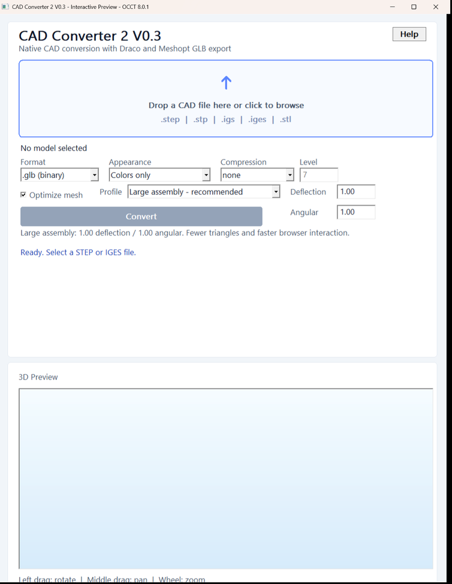
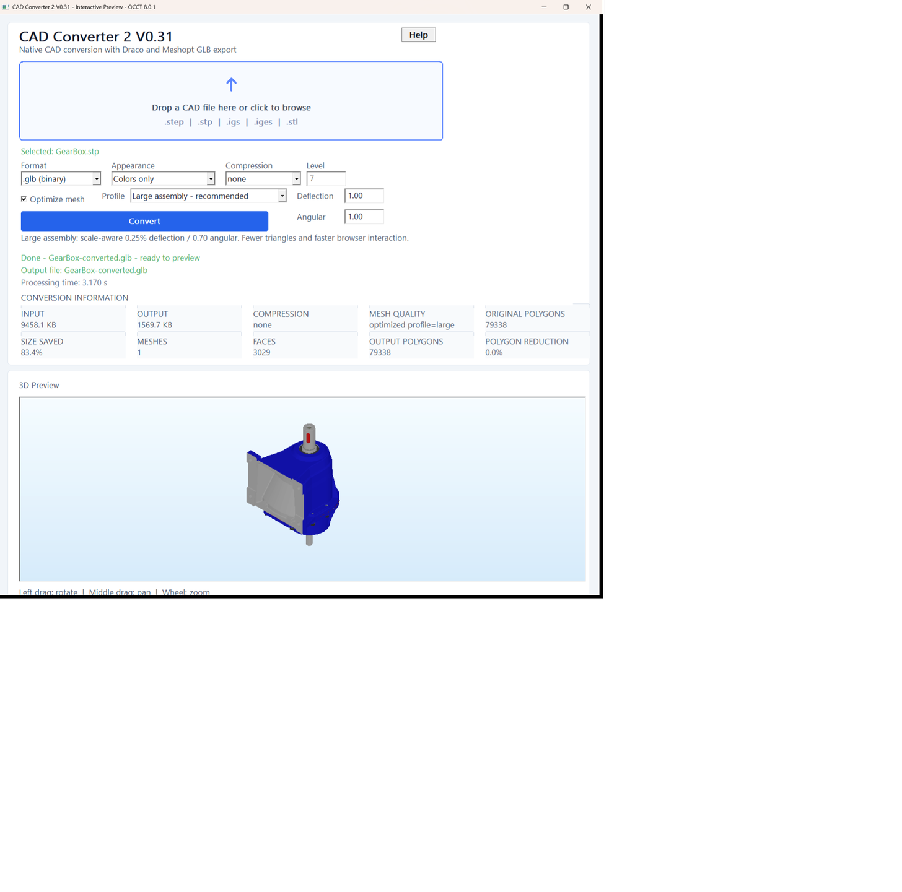
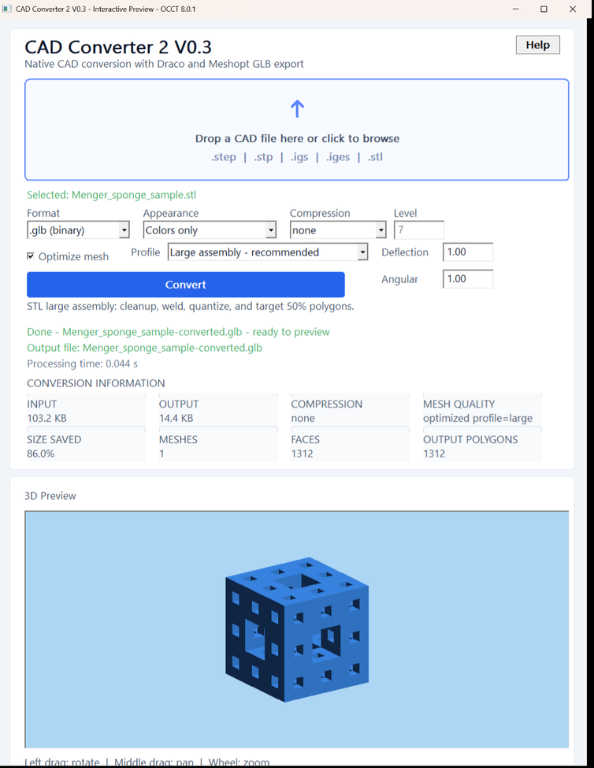
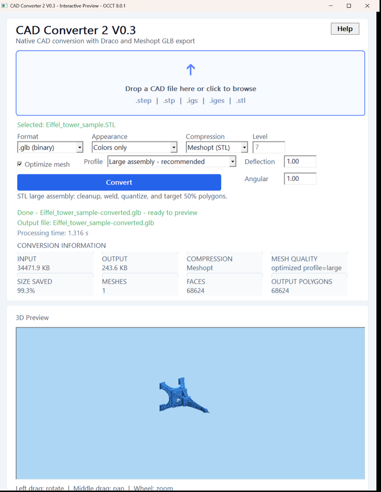

# CAD Converter 2 V0.31 — User Manual

Version: V0.31 · Platform: Windows 10/11, 64-bit

Author: Chan Lap Chi  
Email: lcchan@r2innov.com  
Copyright: © 2026 R Innovation

---

## 1. Overview

CAD Converter 2 converts supported CAD and mesh files into browser-friendly GLB or GLTF files. Conversion runs locally on the Windows computer. No upload or remote server is required.

Supported input formats:

- STEP: `.step`, `.stp`
- IGES: `.igs`, `.iges`
- STL: `.stl` — binary and ASCII

Supported output formats:

- GLB: `.glb` binary single-file output
- GLTF: `.gltf` with external binary data where required

V0.31 includes:

- Native high-speed STL-to-GLB conversion
- STL polygon cleanup and simplification profiles
- Draco compression through the OCCT path
- Meshopt compression for STL GLB output
- Scale-aware STEP/IGES triangulation profiles
- Hardware-accelerated OpenGL STL preview
- OCCT STEP/IGES preview
- Output file size, polygon count, and processing-time reporting

## 2. Required Application Files

Keep these files and folders together in the Release package:

```text
cad-converter2.exe
gltfpack.exe
stl-benchmark.exe
docs\
  licenses\
OCCT runtime DLL files
```

`gltfpack.exe` is required when STL optimization is enabled or **Meshopt (STL only)** is selected. STEP and IGES stay on the OCCT hierarchy-preserving path.

## 3. Main Window



The main window contains:

1. **Help** — opens this PDF manual.
2. **File drop area** — drag a supported file here or click to browse.
3. **Format** — select GLB or GLTF output.
4. **Appearance** — choose colors-only or texture-preserving behavior where supported.
5. **Compression** — choose none, Draco, or Meshopt for STL only.
6. **Optimize mesh** — enables mesh cleanup, welding, quantization, and profile simplification.
7. **Profile** — controls quality and polygon targets.
8. **Convert** — starts conversion.
9. **Conversion information** — reports input/output size, compression, profile, polygon count, and size reduction.
10. **Assembly tree** — displays XCAF part names and nested assembly structure for STEP/IGES.
11. **3D Preview** — displays the converted or source geometry for inspection.

## 4. Selecting a File

Use either method:

- Drag a supported CAD file from File Explorer onto the drop area.
- Click the drop area and select a file in the Windows file dialog.

The selected filename appears in light green below the drop area. The **Convert** button becomes active after a valid file is selected.

If a file is unsupported, the status area displays an error message.

## 5. Output Format

### GLB — recommended

GLB stores geometry, scene information, and supported embedded assets in one binary file. Use GLB for browser viewers, sharing, and compact delivery.

### GLTF

GLTF may use a JSON file plus companion binary data. Native fast STL conversion and Meshopt compression are designed primarily for GLB output.

## 6. Appearance

### Colors only

Exports basic colors without preserving texture images. This is recommended for CAD assemblies and smaller browser assets.

### Preserve textures

Requests texture preservation where the source format and conversion path support textures. STEP, IGES, and STL commonly contain geometry and colors rather than texture images.

## 7. Compression Options

### none

Produces a standard uncompressed GLB/GLTF. When **Optimize mesh** is enabled, STL geometry is still cleaned, welded, reordered, and quantized.

### Draco

Uses OCCT's Draco-enabled GLB writer. For STL, this path loads and processes the model through OCCT and is slower than the native STL path.

The **Level** field is active only for Draco.

### Meshopt (STL only) — recommended for compact STL GLB output

Uses the native STL path followed by meshoptimizer/gltfpack. The result includes:

- `KHR_mesh_quantization`
- `EXT_meshopt_compression`

Meshopt offers small files and fast browser decoding. A web viewer must configure a Meshopt decoder before loading this output. The converter's own native preview does not require a decoder.

## 8. STL Optimization Profiles

STL files are already triangulated. V0.31 applies cleanup and profile-based simplification directly to the input mesh.

| Profile | Target | Recommended use |
|---|---:|---|
| CAD faithful | 100% after cleanup | Archival detail and inspection |
| Viewer balanced | 70% | General browser viewing |
| Large assembly | 50% | Large models and responsive interaction |
| Fast preview | 25% | Quick review and low-bandwidth delivery |
| Custom | Derived from Deflection and Angular | Advanced tuning |

When optimization is enabled, the pipeline runs in this order:

1. Remove degenerate polygons.
2. Remove exact duplicate polygons.
3. Weld equivalent vertices.
4. Optimize vertex and index order.
5. Quantize positions and normals.
6. Simplify to the selected profile target.
7. Apply Meshopt compression when selected.

Turn off **Optimize mesh** to preserve all source polygons. Meshopt compression can still reduce file size without intentional polygon simplification.

## 9. STEP and IGES Quality Profiles

STEP and IGES are CAD boundary-representation formats. Their polygon count is created during triangulation.

- Lower deflection and angular values preserve more detail and produce more polygons.
- Higher values generate fewer polygons and faster browser interaction.

Profiles use scale-aware triangulation values so the same profile behaves consistently across differently sized models:

- **CAD faithful** — 0.05% model-diagonal deflection / 0.25 angular tolerance
- **Viewer balanced** — 0.10% / 0.45
- **Large assembly** — 0.25% / 0.70
- **Fast preview** — 0.50% / 1.00

STEP and IGES do not use Meshopt post-processing because preserving their part names and assembly hierarchy is required. Use `none` or Draco for those formats.

## 10. Converting a Model

1. Select or drop a model.
2. Choose GLB or GLTF.
3. Choose appearance behavior.
4. Select compression.
5. Enable or disable optimization.
6. Select a profile.
7. Click **Convert**.

The application disables the Convert button while processing. When complete, it displays a green success status and the output filename.

The output file is written beside the source file using this naming pattern:

```text
original-name-converted.glb
```

## 11. Conversion Results

The result panel reports:

- **Input** — original file size
- **Output** — converted file size
- **Compression** — none, Draco, or Meshopt
- **Mesh quality** — selected profile and STL polygon target or CAD triangulation settings
- **Size saved** — percentage difference between input and output
- **Parts** — exported part count
- **Original B-Rep faces** — source STEP/IGES topological face count before tessellation
- **Original mesh faces** — source facets when the input is STL
- **Result mesh faces** — final exported mesh triangle count
- **Face reduction** — percentage reduction from original to result faces
- **Processing time** — complete conversion duration

Polygon targets are goals. The simplifier may stop near a target to preserve topology and quality.

## 12. Hardware 3D Preview

STL preview uses native hardware OpenGL. STEP and IGES preview use OCCT's OpenGL viewer. Both use the light-blue gradient background.

Controls:

- **Left drag** — rotate/orbit
- **Middle drag** — pan
- **Mouse wheel** — zoom

The preview is intended for visual inspection. For optimized STL output, the application reports the actual output polygon count while the preview retains sufficient source detail for inspection.

For STEP and IGES, **Original B-Rep Faces** is the CAD topological face count and does not change with the meshing profile. **Result Mesh Faces** is the triangulated face count and changes with tessellation quality. Part names and assembly structure are preserved; Meshopt is intentionally unavailable for these formats.

When an IGES file contains component instances but no meaningful names, the converter preserves the root/component structure and assigns stable fallback instance names such as `Part 001`, `Part 002`, and so on. The generated names are written into both the assembly tree and exported GLTF/GLB nodes. Existing meaningful IGES names are never replaced.

## 13. STEP/IGES Assembly Tree



The left panel is populated from the OCCT XCAF document. It preserves the source label names and recursively displays child labels. The 3D preview on the right is generated from the same document, so the tree and displayed assembly refer to the same conversion result.

GearBox STEP example using the hierarchy-preserving OCCT path:

```text
Original B-Rep faces: 3,029
Result mesh faces: 79,338
Face reduction: n/a (CAD face to mesh face)
Output size: 1,569.7 KB
Processing time: approximately 3.2 seconds
```

## 14. Example — Menger Sponge



Test result using the Large assembly profile:

```text
Original faces: 2,112
Result faces: 1,312
Output size: 14.4 KB
Processing time: approximately 0.04 seconds
```

## 15. Example — Eiffel Tower with Meshopt



Test result using Large assembly plus Meshopt:

```text
Original faces: 139,989
Result faces: 68,624
Output size: 243.6 KB
Processing time: approximately 1.3 seconds
```

CAD faithful cleanup removes exact duplicate and degenerate facets while preserving intended detail:

```text
Result faces: 139,441
Output size without Meshopt compression: approximately 4.0 MB
```

## 16. Meshopt Viewer Compatibility

A Meshopt-compressed GLB requires decoder support. For Three.js, configure `GLTFLoader` with `MeshoptDecoder` before loading the file.

If a viewer reports an unsupported `EXT_meshopt_compression` extension:

- Enable Meshopt decoding in that viewer, or
- Convert again with Compression set to **none**.

## 17. Troubleshooting

### Convert button is disabled

Select a supported file first.

### `gltfpack.exe is missing beside the converter`

Restore `gltfpack.exe` beside `cad-converter2.exe`. Re-extract the complete Release package rather than copying only the main executable.

### Optimized STL output looks too simple

Choose Viewer balanced or CAD faithful, or turn off Optimize mesh.

### Output is still too large

Choose Meshopt compression and a stronger reduction profile. Fast preview targets approximately 25% of cleaned polygons.

### Meshopt GLB does not load in a browser

Configure the viewer's Meshopt decoder or export again without Meshopt compression.

### 3D preview is empty

Confirm that the conversion succeeded and that the input contains valid polygons. Update the graphics driver if the hardware preview cannot initialize.

### Help manual is missing

Ensure this file exists relative to the executable:

```text
docs\CAD-Converter-2-V0.31-User-Manual.pdf
```

## 18. Privacy and Local Processing

CAD Converter 2 processes files locally. The application does not upload models or require an internet connection for conversion. Keep generated files and source CAD data according to your organization's storage and confidentiality requirements.

## 19. Version Information

```text
Application: CAD Converter 2
Version: V0.31
Native STL: binary and ASCII
Mesh optimization: meshoptimizer/gltfpack 0.25
CAD kernel: Open CASCADE Technology 8.0.1
```

## 20. Open Source Acknowledgements and Copyright

CAD Converter 2 V0.31 is authored by **Chan Lap Chi** and copyright © 2026 **R Innovation**.

This application includes and/or uses the following open-source components:

- **Open CASCADE Technology 8.0.1** — used for STEP, IGES, XCAF, and OCCT preview functionality. Distributed under the GNU Lesser General Public License version 2.1 with the Open CASCADE exception. The applicable license text is included at `docs/licenses/occt-LGPL-2.1-LICENSE.txt`.
- **meshoptimizer 0.25** by Arseny Kapoulkine — used through `gltfpack.exe` for STL cleanup, vertex optimization, quantization, simplification, and Meshopt compression. Distributed under the MIT License. The applicable license text is included at `docs/licenses/meshoptimizer-MIT-LICENSE.md`.
- **Draco** — optional compression support when the converter is built and packaged with a Draco-enabled OCCT runtime. Any Draco runtime distribution must retain its applicable upstream notices.

The full source and license files for vendored meshoptimizer are retained under `third_party/meshoptimizer` in the source distribution. Third-party copyright and license notices remain the property of their respective authors and contributors.
